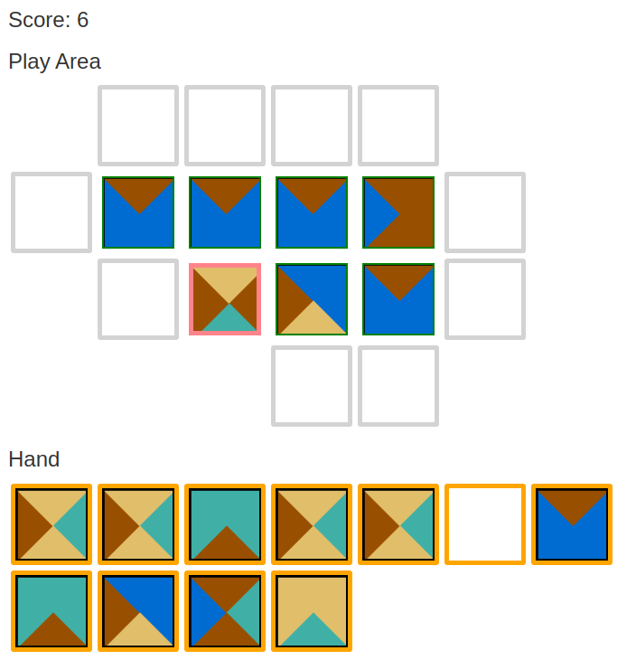

Hack-A-Day is a project I'm doing in November, where I try to make 30 new projects, in 30 days.

# Day 11: Hack-A-Tile

This is a tile-placing game. Try to beat your high score. The tiles used are a famous mathematical construction called aperiodic Wang tiles.

Demo available at [here](https://tilde.za3k.com/hackaday/machine).

Source available on [github](https://github.com/za3k/day11_tile).
